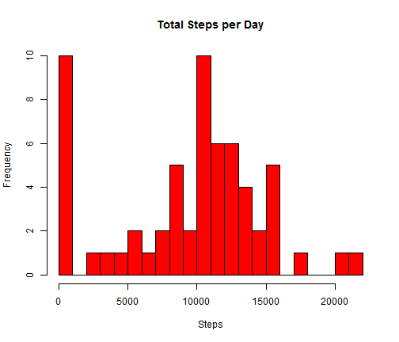
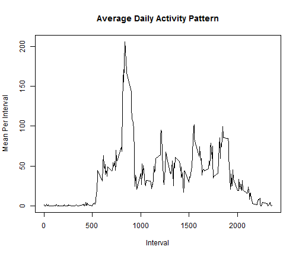
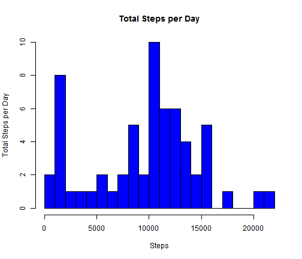
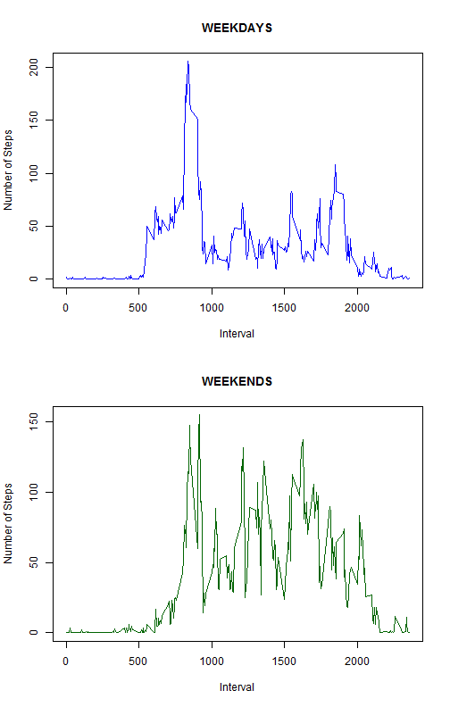

# Reproducible Research: Peer Assessment 1


## Loading and preprocessing the data

1. Load the data, stored in a csv file, called *activity.csv*  


```r
mT <- read.csv(file="./activity.csv")
```

2. Process data into a **matrix** format, more suitable for the analysis, columns with **dates**, *date* farmat, and rows with **intervals** . Then, calculate two vector with dates and intervals


```r
steps <- matrix(mT$steps, nrow=288, ncol=61)
dates <- as.Date(mT$date[288*c(1:61)])
intervals <- mT$interval[1:288]
```


## What is mean total number of steps taken per day?

1 We make a histogram of the total number of steps taken each day, ignoring the missing vales of the Datase  


```r
TotalStepsPerDay <- apply(steps,2,sum, na.rm=TRUE)
hist(TotalStepsPerDay,breaks=20, col="red", xlab="Steps", main="Total Steps per Day")
```

 

2 Calculate and report the mean and median total number of steps taken per day


```r
meanTotalPerDay <- (mean(TotalStepsPerDay))
medianTotalPerDay <- (median(TotalStepsPerDay))
```

So the resulting values are: **mean:** 9354.2295 and **median:** 10395

## What is the average daily activity pattern?

1 Make a time series plot of the 5-minute interval (x-axis) and the average number of steps taken, averaged across all days (y-axis)


```r
MeanPerInterval <- apply(steps, 1, mean, na.rm=TRUE)
plot(intervals, MeanPerInterval,type="l", xlab="Interval",
     ylab= "Mean Per Interval" ,main= "Average Daily Activity Pattern")
```

 


2 Calculate the 5-minute interval, on average across all the days in the dataset, contains the maximum number of steps:  


```r
maximum <- intervals[which(MeanPerInterval==max(MeanPerInterval))]
```

Then, the maximun average steps ocurring in the interval **8:35**

## Imputing missing values
 
1 Calculate and report the total number of missing values in the dataset   


```r
TotalDaysMissing = sum(apply(steps,2, function(x) sum(is.na(x))!=0))
```
So, the total number of days with missing values in the dataset is 8

2 A strategy for filling in all of the missing values in the dataset: I use the median for that 5-minute interval. So, first calculate the median for each interval


```r
medianPerInterval <- apply(steps, 1, median,na.rm=TRUE)
```

3 Create a new dataset that is equal to the original dataset but with the missing data filled in.  


```r
new_steps <- apply(steps, 2, function(x) ifelse(is.na(x),medianPerInterval,x))
```

4 Make a histogram of the total number of steps taken each day


```r
NewTotalStepsPerDay <- apply(new_steps,2, sum, na.rm=TRUE)
hist(NewTotalStepsPerDay,breaks=20, col="blue", xlab="Steps", 
     ylab = "Total Steps per Day", main="Total Steps per Day")
```

 

Calculate and report the mean and median total number of steps taken per day:


```r
meanTotalPearDay <- (mean(TotalStepsPerDay))
medianTotalPerDay <- (median(TotalStepsPerDay))
```

In the previous histogram, the **mean** is 9354.2295 and the **median**
10395 

These values **do not** differ significatively from the estimates from the first part of the assignment. The impact of imputing missing data on the estimates of the total daily number of steps is very low, only 8 values changes fron NA, to 10395

## Are there differences in activity patterns between weekdays and weekends?

For this part we'll use the new_steps, with the filled-in missing values  

1 Create a new factor variable in the dataset with two levels – “weekday” and “weekend” indicating whether a given date is a weekday or weekend day.  


```r
W <- factor(weekdays(dates,abbreviate=TRUE) %in% c("Mon","Tue","Wed","Thu","Fri"), 
            levels=c(TRUE, FALSE), labels=c("weekday", "weekend"))
    
MeanPerIntervalWeekDays <- apply(new_steps[,W=="weekday"], 1, mean)
MeanPerIntervalWeekEnds <- apply(new_steps[,W=="weekend"], 1, mean)
```

2 Make a panel plot containing a time series plot of the 5-minute interval (x-axis) and the average number of steps taken, averaged across all weekday days or weekend days (y-axis).


```r
par(mfrow=c(2,1))
plot(intervals, MeanPerIntervalWeekDays, type="l", xlab="Interval", 
     ylab="Number of Steps", main ="WEEKDAYS", col="blue")
plot(intervals, MeanPerIntervalWeekEnds, type="l", xlab="Interval", 
     ylab="Number of Steps", main ="WEEKENDS", col="green")
```

 

**Conclusion:** The two patterns differ considerably, both in shape and values


